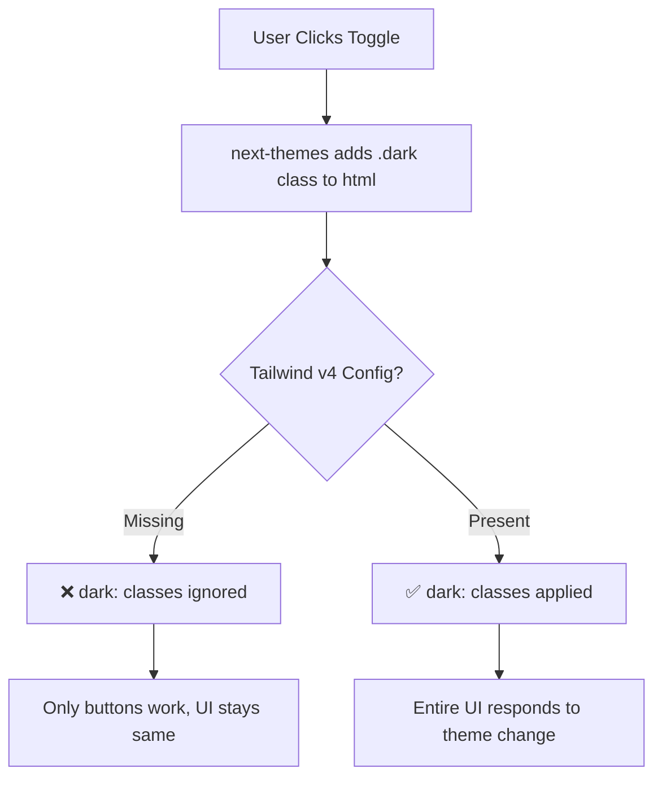

# Light & Dark Mode Troubleshooting Guide

## 1. Why Was Light/Dark Mode Not Working?

### The Root Cause
Your light/dark mode toggle button was working and switching themes, but **the UI wasn't responding** to the theme changes. Here's why:

#### Problem #1: **Tailwind CSS v4 Configuration Missing**
- **What happened**: You're using Tailwind CSS v4, which has a completely different configuration system than v3
- **The issue**: Tailwind v4 doesn't use `tailwind.config.js` for dark mode
- **Result**: All your `dark:` utility classes (like `dark:bg-gray-900`, `dark:text-white`) were being **completely ignored**

```
❌ Old way (v3): tailwind.config.js → darkMode: 'class'
✅ New way (v4): globals.css → @custom-variant dark (...)
```

#### Problem #2: **Missing CSS Custom Variant Directive**
- Tailwind v4 requires a special CSS directive to enable class-based dark mode
- Without this directive, Tailwind doesn't know to look for the `.dark` class
- The directive was missing from your `globals.css` file

#### Problem #3: **Incorrect CSS Variable Selectors**
- Your CSS variables were using `.dark` selector
- But Tailwind v4 expects `html.dark` for proper cascade
- This caused a mismatch between what `next-themes` was doing and what your CSS expected

### Visual Breakdown



---

## 2. How Did I Fix It?

### Fix #1: Added Tailwind v4 Dark Mode Directive

**File**: `src/app/globals.css`

**Added this line**:
```css
@custom-variant dark (&:where(.dark, .dark *));
```

**What it does**:
- Tells Tailwind v4 to look for `.dark` class on any ancestor element
- When found, applies all `dark:` utility classes
- Works with `next-themes` which adds `.dark` to the `<html>` tag

### Fix #2: Updated CSS Variable Selectors

**Before**:
```css
.dark {
  --background: #0a0a0a;
  --foreground: #ededed;
}
```

**After**:
```css
html.dark {
  --background: #0a0a0a;
  --foreground: #ededed;
}
```

**Why**: More specific selector ensures proper cascade and matches how `next-themes` applies the class.

### Fix #3: Wrapped Variables in @layer base

**Before**:
```css
:root {
  --background: #ffffff;
}
```

**After**:
```css
@layer base {
  :root {
    --background: #ffffff;
  }
  
  html.dark {
    --background: #0a0a0a;
  }
}
```

**Why**: Ensures proper CSS cascade order in Tailwind v4.

### Fix #4: Removed Obsolete tailwind.config.js

**Action**: Deleted the `tailwind.config.js` file

**Reason**: 
- Tailwind v4 doesn't read this file anymore
- It uses CSS-based configuration instead
- Having it could cause confusion

### Fix #5: Restarted Development Server

**Action**: Ran `npm run dev` again

**Reason**: Tailwind v4 needs to reprocess CSS when configuration changes.

---

## 3. Prompts for Future Troubleshooting

### When Dark Mode Toggle Doesn't Work:

#### Prompt 1: Initial Diagnosis
```
"My light/dark mode toggle button is working but the UI doesn't change themes. 
I'm using Tailwind CSS v4 with next-themes. The button switches the theme state 
but my dark: classes aren't being applied. Help me diagnose and fix this."
```

#### Prompt 2: Check Configuration
```
"I'm using Tailwind CSS v4. Check my globals.css file and verify if I have the 
correct @custom-variant dark directive. Also check if my CSS variables are 
properly configured for dark mode with html.dark selector."
```

#### Prompt 3: Verify Package Versions
```
"Check my package.json and tell me if there are any conflicts between my 
Tailwind CSS version, next-themes version, and Next.js version. Suggest the 
correct dark mode setup for my specific versions."
```

#### Prompt 4: Complete Dark Mode Setup
```
"I need to set up dark mode in my Next.js project using Tailwind CSS v4 and 
next-themes. Please:
1. Check my globals.css for the @custom-variant dark directive
2. Verify my ThemeProvider is configured correctly
3. Check if my layout.tsx has suppressHydrationWarning
4. Ensure CSS variables work in both themes
5. Test that dark: utility classes are working"
```

#### Prompt 5: Specific Component Issue
```
"My [component name] isn't responding to dark mode changes. Other components 
work fine. The component uses these Tailwind classes: [list classes]. Help me 
add proper dark mode support to this specific component."
```

#### Prompt 6: Migration from v3 to v4
```
"I'm migrating from Tailwind CSS v3 to v4. My old dark mode setup used 
tailwind.config.js with darkMode: 'class'. Help me convert this to the new 
Tailwind v4 CSS-based configuration system."
```

#### Prompt 7: Debugging Checklist
```
"Run a complete dark mode diagnostic on my Next.js + Tailwind v4 project:
1. Verify @custom-variant dark is present
2. Check ThemeProvider setup
3. Verify html tag has suppressHydrationWarning
4. Check if .dark class is being added to <html>
5. Test CSS variable switching
6. Verify dark: utility classes compile correctly
Give me a step-by-step fix for any issues found."
```

---

## Quick Reference: Tailwind v4 Dark Mode Checklist

- [ ] `@custom-variant dark (&:where(.dark, .dark *));` in globals.css
- [ ] CSS variables wrapped in `@layer base`
- [ ] Variables use `html.dark` selector (not just `.dark`)
- [ ] `suppressHydrationWarning` on `<html>` tag
- [ ] ThemeProvider with `attribute="class"`
- [ ] No `tailwind.config.js` (or it's ignored for dark mode)
- [ ] Dev server restarted after config changes
- [ ] All components use `dark:` utility classes for dark mode styles

---

## Common Mistakes to Avoid

### ❌ Don't Do This:
```css
/* Wrong - v3 style */
.dark {
  --background: #000;
}
```

```javascript
// Wrong - v3 style, doesn't work in v4
// tailwind.config.js
module.exports = {
  darkMode: 'class',
}
```

### ✅ Do This Instead:
```css
/* Correct - v4 style */
@custom-variant dark (&:where(.dark, .dark *));

@layer base {
  html.dark {
    --background: #000;
  }
}
```

---

## Testing Your Dark Mode

### Manual Test Steps:
1. Open browser DevTools (F12)
2. Click your theme toggle button
3. Check if `<html>` tag has `class="dark"` added/removed
4. Inspect an element with dark mode classes
5. Verify the dark: classes are being applied in Computed styles
6. Check localStorage for theme persistence (key: "theme")

### Console Commands:
```javascript
// Check current theme
localStorage.getItem('theme')

// Check if html has dark class
document.documentElement.classList.contains('dark')

// Manually toggle for testing
document.documentElement.classList.toggle('dark')
```

---

## Additional Resources

- [Tailwind CSS v4 Documentation](https://tailwindcss.com/docs/v4-beta)
- [next-themes GitHub](https://github.com/pacocoursey/next-themes)
- [Tailwind v4 Dark Mode Guide](https://tailwindcss.com/docs/dark-mode)

---

## Summary

**The Problem**: Tailwind v4's different configuration system meant your dark mode classes weren't being processed.

**The Solution**: Added the `@custom-variant dark` directive to tell Tailwind v4 how to handle dark mode.

**The Result**: Your `dark:` utility classes now work, and the entire UI responds to theme changes.

---

*Last Updated: December 2025*
*Tailwind CSS Version: v4*
*Next.js Version: 16.1.0*

